# Classifying Concord: Machine Learning Meets Transcendentalism

© 2025 Richard Anton. All rights reserved.

The accompanying code, but not this article itself, is licensed under the MIT License. See the LICENSE file for details.

The literary works referenced in this article are in the public domain.

## Introduction

This article is a walkthrough of using machine learning classification techniques combined with some preprocessing to distinguish between the writing of Emerson and Thoreau.  

I wanted to show methods for classifying text using a novel dataset rather than one of the toy ones so often used for tutorials. Eventually I settled on classifying text to predict the original author.  Since I wanted this to be primarily about actual writing style rather than the changes to language between regions or over time I chose two authors from the same era and location, Emerson and Thoreau. For background on computational authorship attribution see Koppel et al. (2009) .

Ralph Waldo Emerson and Henry David Thoreau both resided in mid-19th-century Concord, Massachusetts. Their writings and philosophical exchanges contributed to [American Transcendentalism](https://plato.stanford.edu/entries/transcendentalism/), and both produced literary works that remain influential. Despite their shared location and intellectual community, their writing styles differ in identifiable ways.

*Walden* has always been one of my favorite books and had a big influence on me when I first read it in high school, but Emerson was a different story. I found his writing style wordy and frustrating. Recently I revisited the context of these works when I read *[The Transcendentalists and Their World](https://us.macmillan.com/books/9780374279325/thetranscendentalistsandtheirworld/)* (Gross, 2021) which gave me the idea to use their writings as the basis for this project.

All the code and data used in this study can be accessed via the GitHub repo [http://github.com/ranton256/classifying_concord](github.com/ranton256/classifying_concord).

The dataset was created from two public domain works, one by each author. For Emerson, I used *Essays: First Series* (1841), and for Thoreau, there was really no choice but *Walden, and On The Duty Of Civil Disobedience* (1854). 

This dataset offers several practical advantages for educational purposes:

1. **Historical context**: The texts come from the same historical period and location.
2. **Controlled variables**: Both authors wrote philosophical prose on related themes.
3. **Clear differences**: Despite similarities in topic, the authors maintain distinct writing styles.
4. **Accessibility**: The works are in the public domain and widely available.

The texts were segmented into passages of 3-5 sentences each, creating a collection of labeled examples for training and testing classification models.

To explore how different machine learning approaches perform on this task I compared multiple methods.  These included traditional methods, including logistic regression, random forests, and support vector machines, along with newer transformer-based models.

## The Evolution of Machine Learning Classification

Text classification has developed substantially over the years. Early methods in the 1960s relied on hand-crafted rules, for example Rocchio (1971), then statistical techniques took over. Advanced neural networks joined simpler statistical models in the following years, notably recurrent neural networks (Sebastiani, 2002). More recently, transformer-based models have gained prominence in this and most other natural language processing (NLP) use cases from 2018 onward.

1. **Rule-based systems** (1960s-1980s):  Manually crafted rules and decision trees.
2. **Statistical methods** (1990s-2000s): Naïve Bayes, Support Vector Machines, and Logistic Regression
3. **Neural network approaches** (2010s): Recurrent neural networks (RNNs) including LSTMs (Hochreiter & Schmidhuber, 1997) and convolutional neural networks (CNNs) (LeCun et al. 1998).
4. **Transformer models** (2018-present): BERT,  GPT, and their derivatives following the original "Attention is All You Need" paper on transformers Vaswani, A. et al., 2017).

Each era brought improvements to accuracy and capability. The field also expanded from simple categorization to include other use cases like sentiment analysis, authorship attribution (Stamatatos, 2009), and stylometry—the quantitative study of writing style (Burrows, 2002).

In our Concord project, we compare methods across this range, from traditional TF-IDF based classification to transformer-based models.

## Creating a Unique Literary Dataset

### Data Acquisition

First, we selected two representative texts from Project Gutenberg's public domain collection. ([Project Gutenberg](https://www.gutenberg.org/), n.d.). 

```python
emerson_txt_url = "https://www.gutenberg.org/ebooks/16643.txt.utf-8"
thoreau_txt_url = "https://www.gutenberg.org/ebooks/205.txt.utf-8"

def download_file(url):
    local_filename = Path(url.split('/')[-1])
    result = requests.get(url)
    result.raise_for_status()
    with open(local_filename, "wb") as f:
        f.write(result.content)
    return local_filename
    
emerson_file = download_file(emerson_txt_url)
thoreau_file = download_file(thoreau_txt_url)
```

This programmatic approach ensures reproducibility and automation, eliminating the need for manual file handling.

### Text Preprocessing

Both works contain Project Gutenberg boilerplate text that needs removal. We identify the start of the actual content by searching for the standard "START OF THE PROJECT GUTENBERG EBOOK" marker:

```python
def trim_frontmatter(filename):
    with open(filename) as f:
        lines = f.readlines()
    n_trim_lines = 0
    for i, line in enumerate(lines):
        if "START OF THE PROJECT GUTENBERG EBOOK" in line:
            n_trim_lines = i + 1
            break
    trimmed_lines = lines[n_trim_lines:]
    trimmed_content = '\n'.join(trimmed_lines)
    new_filename = f"trimmed_{filename}"
    with open(new_filename, "w") as f:
        f.write(trimmed_content)
    return new_filename
```

### Text Segmentation

We segment the texts into manageable chunks of 3-5 sentences each. This creates a dataset with many examples for training and testing while preserving enough context to capture authorial style. We use [spaCy](https://spacy.io/), a powerful and popular natural language processing library, to perform the segmentation (Honnibal & Montani, 2017). 

This function creates randomly-sized windows of 3-5 sentences, providing natural text chunks while introducing variation in the dataset.

```python
def segment_doc(filename):
    with open(filename) as f:
        text = f.read()
    doc = nlp(text)
    assert doc.has_annotation("SENT_START")
    sent_dq = deque()
    n = randint(3, 5)
    for sent in doc.sents:
        sent_dq.append(sent)
        if len(sent_dq) > n:
            sent_dq.popleft()
        snippet = " ".join(sent.text for sent in sent_dq)
        yield snippet
        n = randint(3, 5)
        sent_dq.clear()
```


### Dataset Creation

We create pandas DataFrames from these segments and label them with their respective authors:

```python
emerson_df = dataframe_from_file(trimmed_emerson_file)
emerson_df["label"] = "emerson"

thoreau_df = dataframe_from_file(trimmed_thoreau_file)
thoreau_df["label"] = "thoreau"

combined_df = pd.concat([emerson_df, thoreau_df])
combined_df = shuffle(combined_df, random_state=7919)
```

The result is a dataset of 1,911 text segments (1,064 from Emerson and 847 from Thoreau), each labeled with its author. This balance helps prevent biases in our models.


## Overview of Methods

At a high level there are two versions of the ML pipeline whether we are using a deep learning/transformers based approach or using a more traditional path.


**Traditional path** (blue): Raw Text → Preprocessing → TF-IDF → Classical ML models → Classification (83-86% accuracy)

**Transformer path** (green): Raw Text → Preprocessing → BERT embeddings → Fine-tuned model → Classification (92% accuracy)

```mermaid
flowchart TD
    A["📝 Raw Text<br/>Emerson: 'Essays: First Series'<br/>Thoreau: 'Walden & Civil Disobedience'<br/>1,911 text segments"] --> B["🔧 Preprocessing<br/>• Remove Project Gutenberg boilerplate<br/>• Segment into 3-5 sentences<br/>• Remove stopwords & punctuation<br/>• Lemmatization with spaCy"]
    
    B --> C["🔀 Feature Extraction Split"]
    
    C --> D["📊 Traditional Path:<br/>TF-IDF Vectorization"]
    C --> E["🧠 Transformer Path:<br/>DistilBERT Embeddings"]
    
    D --> F["🎯 Classical ML Models<br/>• Logistic Regression<br/>• Random Forest<br/>• Support Vector Machine"]
    
    E --> G["🔧 DistilBERT Feature Extraction"]
    E --> H["🎯 Fine-tuned DistilBERT"]
    
    G --> I["🎯 Classical ML + BERT Features<br/>• Logistic Regression<br/>• SVM"]
    
    F --> J["📈 Results: 83-86% Accuracy<br/>🏆 Best: SVM (86%)"]
    I --> K["📈 Results: 89-90% Accuracy<br/>🏆 Best: Logistic Regression (90%)"]
    H --> L["📈 Results: 92% Accuracy<br/>🏆 Best Overall Performance"]
    
    J --> M["🎯 Final Classification<br/>Emerson vs Thoreau"]
    K --> M
    L --> M
    
    style A fill:#0d47a1,color:#ffffff
    style B fill:#4a148c,color:#ffffff
    style C fill:#e65100,color:#ffffff
    style D fill:#c62828,color:#ffffff
    style E fill:#2e7d32,color:#ffffff
    style F fill:#d32f2f,color:#ffffff
    style G fill:#388e3c,color:#ffffff
    style H fill:#1976d2,color:#ffffff
    style I fill:#558b2f,color:#ffffff
    style J fill:#b71c1c,color:#ffffff
    style K fill:#33691e,color:#ffffff
    style L fill:#1565c0,color:#ffffff
    style M fill:#37474f,color:#ffffff
```




## Text Representation Techniques

### Visualization with Word Clouds

Before diving into classification, we visualize the most frequent words used by each author through word clouds, excluding common stopwords:


These visualizations already reveal interesting differences in vocabulary. Emerson's text prominently features abstract terms like "soul," "nature," "truth," and "power," reflecting his focus on philosophical concepts. Thoreau's cloud emphasizes more concrete words like "house," "wood," "water," and "life," mirroring his practical observations at Walden Pond.

### Text Preprocessing for ML

For machine learning, we preprocess the text using spaCy to remove stopwords and perform lemmatization, which reduces words to their base forms:

```python
final_text = []
for index, entry in enumerate(combined_df['text']):
    doc = nlp(entry.lower())
    Final_words = []
    for word in doc:
        if not word.is_stop and not word.is_punct:
            Final_words.append(word.lemma_)
    final_text.append(' '.join(Final_words))

combined_df['final_text'] = final_text
```

### TF-IDF Vectorization

For our traditional machine learning models, we convert text to numerical features using Term Frequency-Inverse Document Frequency ([TF-IDF](https://en.wikipedia.org/wiki/Tf–idf)) vectorization:

```python
vectorizer = TfidfVectorizer()
X = vectorizer.fit_transform(combined_df["final_text"])
y = combined_df["label"]
```

TF-IDF converts text into numerical vectors by calculating two components for each word: how frequently it appears in a specific document (Term Frequency), and how unique it is across all documents (Inverse Document Frequency) (Jones,  1972). The value combines how frequently the term appears in the document (TF) and how unique it is across all documents (IDF). This balances common words against distinctive ones that might better differentiate the authors (Salton & Buckley, 1988).    

## Traditional ML Classification Models

We split our dataset into training (80%) and test (20%) sets to evaluate model performance:

```python
x_train, x_test, y_train, y_test = train_test_split(X, y, test_size=0.2, random_state=4909)
```

### Logistic Regression

We begin with [logistic regression](https://en.wikipedia.org/wiki/Logistic_regression), a simple but effective linear classifier (Cox, D.R., 1958).

```python
lr_model = LogisticRegression(solver='saga', random_state=8102, n_jobs=-2)
lr_model.fit(x_train, y_train)
y_pred = lr_model.predict(x_test)
```

And here we have our results for this first model.

If you are not already familiar with precision, accuracy, recall, and F1 metrics for model evaluation or want a review, then I recommend the article [Performance Metrics: Confusion matrix, Precision, Recall, and F1 Score](https://towardsdatascience.com/performance-metrics-confusion-matrix-precision-recall-and-f1-score-a8fe076a2262/)  (Jayaswal, V. , 2020).

```
precision    recall  f1-score   support

emerson       0.84      0.90      0.87       210
thoreau       0.87      0.79      0.83       173

accuracy                          0.85       383
```


Logistic regression achieves an impressive 85% accuracy, correctly identifying the author in most cases. 

Here we have included confusion matrix. For space we will omit this for most of the models, but they are available in the [GitHub repo](https://github.com/ranton256/classifying_concord/tree/main).

### Random Forest

Next, we implement a Random Forest classifier, which creates an ensemble of decision trees (Breiman, 2001).

```python
rf = RandomForestClassifier()
rf.fit(x_train, y_train)
y_pred_rf = rf.predict(x_test)
```

Results:
```
precision    recall  f1-score   support

emerson       0.82      0.88      0.85       210
thoreau       0.84      0.76      0.80       173

accuracy                          0.83       383
```

The Random Forest model achieves 83% accuracy, slightly lower than logistic regression.

### Support Vector Machine

We also implement a [Support Vector Machine](https://en.wikipedia.org/wiki/Support_vector_machine) (SVM) with a radial basis function kernel. SVM's are often a strong model compared to traditional neural networks (pre-transformer,etc) that can train more quickly and often converge more reliabily (Cortes & Vapnik 1995). If you are not familiar with SVMs and want to understand the theory behind them a good place to start is the KDnuggets article [*A gentle introduction to support vector machines*](https://www.kdnuggets.com/2023/07/gentle-introduction-support-vector-machines.html)  (Priya, 2023). 

```python
clf = svm.SVC(kernel='rbf')
clf.fit(x_train, y_train)
y_pred_svm = clf.predict(x_test)
```

Results:
```
precision    recall  f1-score   support

emerson       0.84      0.90      0.87       210
thoreau       0.87      0.80      0.83       173

accuracy                          0.86       383
```


The SVM achieves our best traditional model performance at 86% accuracy. I think SVM's are somewhat underappreciated amid all the neural network hype, for reference on this see "[Do we Need Hundreds of Classifiers to Solve Real World Classification Problems?](https://dl.acm.org/doi/10.5555/2627435.2697065)"  by Fernández-Delgado et al. (2014). SVMs can be trained in an amount of time that is quite zippy compared to more complex models that do not always beat them without a lot of training data and with less risk of overfitting.

## Deep Learning and Transformer Models

Transformer models revolutionized NLP tasks by capturing complex contextual relationships in text (Wolf et al., 2020). Here we use DistilBERT  (Sanh, Debut, Chaumond, & Wolf, 2019), a lightweight version of BERT (Bidirectional Encoder Representations from Transformers) (Devlin, Chang, Lee, & Toutanova, 2019).  The [Tranformers](https://github.com/huggingface/transformers) open source library (Wolf et al., 2020) from [Hugging Face](https://huggingface.co/) has democratized access to pre-trained transformer models for the broader machine learning community.

Unlike traditional methods that treat words as independent units, transformer models like BERT understand context by analyzing how words relate to all other words in a sentence simultaneously. This 'attention mechanism' allows the model to capture subtle stylistic patterns that might be missed by simpler approaches.

In 2025, DistilBERT is not exactly state of the art, however you can train or fine-tune it easily with modest resources. I did this entire project on Google Colab for free.

We employ two different strategies using DistilBERT:

1. **Feature Extraction**: We freeze DistilBERT's pre-trained weights and use its internal representations as sophisticated features for a traditional classifiers, in our case an SVM model.
2. **Fine-tuning**: We allow DistilBERT's weights to update during training on our dataset, adapting the entire model specifically for our Emerson vs. Thoreau classification task.

### Feature Extraction Approach

First, we use DistilBERT as a feature extractor, employing its hidden states as input to traditional classifiers. This method is useful in situations where you may not have enough data to effectively train a model from scratch, but you want something more powerful than simple feature engineering techniques.

```python
tokenizer = AutoTokenizer.from_pretrained("distilbert-base-uncased")
model = AutoModel.from_pretrained("distilbert-base-uncased")

# Tokenize text and get hidden states
with torch.no_grad():
    hidden_train = model(**x_train_tok)
    hidden_test = model(**x_test_tok)
    # Get the [CLS] hidden states
    cls_train = hidden_train.last_hidden_state[:,0,:]
    cls_test = hidden_test.last_hidden_state[:,0,:]
```

There is a fair bit of code we are leaving out of the article to get things in a form to make the Transformers library happy here since everything before this point was setup with scikit learn.


We then use these features with our traditional classifiers:

**Logistic Regression on DistilBERT hidden states**:
```
precision    recall  f1-score   support

emerson       0.91      0.91      0.91       210
thoreau       0.90      0.89      0.89       173

accuracy                          0.90       383
```


**SVM on DistilBERT hidden states**:
```
precision    recall  f1-score   support

emerson       0.88      0.92      0.90       210
thoreau       0.90      0.85      0.87       173

accuracy                          0.89       383
```

This hybrid approach shows a significant improvement, with accuracy increasing to 90%.

### Fine-tuning DistilBERT

And finally, we [fine-tune](https://huggingface.co/docs/transformers/en/training) DistilBERT specifically for our classification task 

```python
from transformers import DistilBertForSequenceClassification

model = DistilBertForSequenceClassification.from_pretrained(
    'distilbert-base-uncased', num_labels=2
)

# create our optimizer
from torch.optim import AdamW

optimizer = AdamW(model.parameters(), lr=5e-5)
# a bunch of stuff for preprocessing you can find in GitHub...
```

Here we have left out a bunch of preprocessing code and other boiler plate for brevity which you can find in the repo.


```python
from transformers import Trainer, TrainingArguments, DataCollatorWithPadding

data_collator = DataCollatorWithPadding(tokenizer=tokenizer)

training_args = TrainingArguments(
    output_dir="./results",
    learning_rate=2e-4,
    per_device_train_batch_size=8,
    per_device_eval_batch_size=8,
    num_train_epochs=5,
    weight_decay=0.01,
    evaluation_strategy="epoch",
    logging_strategy="epoch"
)

# Define Trainer object for training the model
trainer = Trainer(
    model=model,
    args=training_args,
    train_dataset=tokenized_train,
    eval_dataset=tokenized_test,
    tokenizer=tokenizer,
    data_collator=data_collator,
)

trainer.train()
```

Results:

```
precision    recall  f1-score   support

emerson       0.93      0.93      0.93       210
thoreau       0.91      0.91      0.91       173

accuracy                          0.92       383
```


The fine-tuned DistilBERT achieves our best performance at 92% accuracy, demonstrating how powerful transformer models are for capturing subtle stylistic differences.

## Analysis of Results

### Performance Comparison

Looking at our results across models:
1. Traditional ML models (TF-IDF + classifiers): 83-86% accuracy
2. DistilBERT features + traditional classifiers: 89-90% accuracy
3. Fine-tuned DistilBERT: 92% accuracy

This progression demonstrates the advantages of modern transformer models, which capture contextual information and semantic relationships beyond what bag-of-words approaches can represent.

The 6-9% accuracy improvement from traditional ML to transformers suggests that author style involves subtle contextual patterns beyond simple word frequency that require more sophisticated language understanding to detect.


### Misclassification Analysis

Examining misclassified examples provides linguistic insights:

```python
for i, (txt, lbl, pred) in enumerate(zip(x_test_trans, y_test_trans, y_pred_trans)):
    if lbl != pred:
        print(f"{lbl=},{pred=}")
        row =(my_cat_labels[lbl], my_cat_labels[pred], txt)
        rows.append(row)
```

Several patterns emerge in the 30 misclassified examples (out of 383):

1. **Project Gutenberg boilerplate**: Many misclassifications involve similar license text that appears in both works
2. **Short segments**: Brief text snippets provide insufficient stylistic markers
3. **Universal themes**: When both authors discuss similar philosophical concepts, the distinction blurs
4. **Quotations**: When either author quotes someone else, their personal style is diminished

One interesting observation is that Thoreau's more practical descriptions are rarely misclassified, while his philosophical musings more frequently get attributed to Emerson. This aligns with our understanding of their writing styles—Thoreau's concrete observations of nature are distinctive, while both authors share transcendentalist philosophical language.

It is also interesting to look at the length of passages versus the author prediction correctness.


**Word Count (Median/Average)**

| Classification | Correctly Classified | Incorrectly Classified |
| -------------- | -------------------- | ---------------------- |
| all            | 78.00/90.59          | 68.50/77.50            |
| thoreau        | 100.00/111.79        | 78.50/74.38            |
| emerson        | 62.00/71.52          | 65.50/79.06            |

We can see that the median and average length correleates  significantly with correctness for passages by Thoreau but seems to have less relation for passages by Emerson.


### Model Interpretability

While transformer models achieve the highest accuracy, they function as "black boxes" compared to traditional models. With logistic regression, we can examine the coefficients to identify the most influential words for classification:

The most strongly Emerson-associated terms include abstract nouns and adjectives like "soul," "divine," "intellect," and "universal." Thoreau's distinctive vocabulary includes more concrete terms like "pond," "woods," "house," and action verbs reflecting his practical experiences at Walden.

## Conclusion

###  Key Takeaways

| 📊 **Metric**              | 📈 **Result**             | 🔍 **Key Insight**                                      |
| ------------------------- | ------------------------ | ------------------------------------------------------ |
| **Traditional ML**        | 83-86% accuracy          | SVM performed best among classical methods             |
| **BERT + Classical ML**   | 89-90% accuracy          | Pre-trained features significantly improve performance |
| **Fine-tuned DistilBERT** | 92% accuracy             | Context-aware models excel at stylistic distinction    |
| **Most Distinctive**      | Thoreau's nature writing | Concrete observations vs. abstract philosophy          |
| **Most Challenging**      | Philosophical passages   | Both authors share transcendentalist vocabulary        |

The article demonstrates solid technical work and clear passion for both literature and machine learning. These improvements would make it more accessible to a broader audience while maintaining its technical depth.

Predicting the author of Emerson and Thoreau's writing demonstrates the application of machine learning to literary style classification. The results show how well even simpler ML models can distinguish between these authors. The fine-tuned DistilBERT model achieved 92% accuracy on the test set, while traditional machine learning approaches reached 83-86% accuracy.

The performance progression from traditional to transformer-based models reflects broader developments in natural language processing. TF-IDF vectorization with classic algorithms provided a functional baseline (83-86% accuracy), while transformer models improved on these results (92% accuracy) by capturing contextual relationships between words.

The misclassification analysis revealed specific patterns in the 30 misclassified examples (from 383 total test examples):

1. Project Gutenberg boilerplate text caused confusion for all models
2. Short text segments provided insufficient data for accurate classification
3. Philosophical passages where both authors addressed similar concepts were harder to distinguish
4. Quoted material from other sources disrupted the authors' characteristic styles

Thoreau's nature descriptions and practical observations were rarely misclassified, while his philosophical reflections were sometimes attributed to Emerson. This aligns with the known characteristics of their writing—Thoreau's concrete observations stand distinct from Emerson's typically abstract style.

The classification results highlight the distinct writing styles of that Emerson and Thoreau despite their shared historical context, philosophy, interests, and proximity.

## References

### Literary Works and Sources

1. Emerson, R.W. (1841). *Essays: First Series*. James Munroe and Company. Retrieved from Project Gutenberg: https://www.gutenberg.org/ebooks/16643

2. Gross, R. A. (2021). [*The transcendentalists and their world*](https://us.macmillan.com/books/9780374279325/thetranscendentalistsandtheirworld/). Farrar, Straus and Giroux.

3. Thoreau, H.D. (1854). *Walden, and On The Duty Of Civil Disobedience*. Ticknor and Fields. Retrieved from Project Gutenberg: https://www.gutenberg.org/ebooks/205

4. Richardson, R.D. (1995). *Emerson: The Mind on Fire*. University of California Press.

5. Walls, L.D. (2017). *Henry David Thoreau: A Life*. University of Chicago Press.

6. Buell, L. (2003). *Emerson*. Harvard University Press.

### Machine Learning and NLP References

6. Breiman, L. (2001). Random Forests. *Machine Learning, 45*, 5-32. https://doi.org/10.1023/A:1010933404324
7. Cortes, C., & Vapnik, V.N. (1995). Support-Vector Networks. *Machine Learning, 20*, 273-297.https://doi.org/10.1007/BF00994018
8. Cox, David R. (1958). "The regression analysis of binary sequences (with discussion)". *J R Stat Soc B*. 20 (2): 215–242. https://doi.org/10.1111%2Fj.2517-6161.1958.tb00292.x. [JSTOR](https://en.wikipedia.org/wiki/JSTOR_(identifier)) [2983890](https://www.jstor.org/stable/2983890).
9. Devlin, J., Chang, M.W., Lee, K., & Toutanova, K. (2019). BERT: Pre-training of Deep Bidirectional Transformers for Language Understanding. *Proceedings of NAACL-HLT 2019*, 4171–4186. https://doi.org/10.18653/v1/N19-1423
10. Hastie, T., Tibshirani, R., & Friedman, J. (2009). *The Elements of Statistical Learning: Data Mining, Inference, and Prediction* (2nd ed.). Springer.
11. Honnibal, M., & Montani, I. (2017). spaCy 2: Natural language understanding with Bloom embeddings, convolutional neural networks and incremental parsing.
12. Jayaswal, V. (2020, September 14). *Performance metrics: Confusion matrix, precision, recall, and F1 score*. Towards Data Science. https://towardsdatascience.com/performance-metrics-confusion-matrix-precision-recall-and-f1-score-a8fe076a2262/ 
13. Pedregosa, F., Varoquaux, G., Gramfort, A., Michel, V., Thirion, B., Grisel, O., ... & Duchesnay, É. (2011). Scikit-learn: Machine Learning in Python. *Journal of Machine Learning Research*, 12, 2825-2830.
14. Priya, B. C. (2023, July 10). *A gentle introduction to support vector machines*. KDnuggets. https://www.kdnuggets.com/2023/07/gentle-introduction-support-vector-machines.html
15. Sanh, V., Debut, L., Chaumond, J., & Wolf, T. (2019). DistilBERT, a  distilled version of BERT: smaller, faster, cheaper and lighter. *ArXiv, abs/1910.01108*. https://doi.org/10.48550/arXiv.1910.01108
16. Sebastiani, F. (2002). Machine learning in automated text categorization. *ACM Computing Surveys*, 34(1), 1–47. https://doi.org/10.1145/505282.505283
17. Spärck Jones, K. (1973). Index term weighting. *Inf. Storage Retr., 9*, 619-633.
18. Vaswani, A., Shazeer, N.M., Parmar, N., Uszkoreit, J., Jones, L., Gomez, A.N.,  Kaiser, L., & Polosukhin, I. (2017). [Attention is All you Need.](https://arxiv.org/abs/1706.03762) *Neural Information Processing Systems*.
19. Wolf, T., Debut, L., Sanh, V., Chaumond, J., Delangue, C., Moi, A., ... & Rush, A. M. (2020). Transformers: State-of-the-Art Natural Language Processing. *Proceedings of the 2020 Conference on Empirical Methods in Natural Language Processing: System Demonstrations*, 38–45.

### Computational Stylometry and Literary Analysis

13. Burrows, J. (2002). 'Delta': a Measure of Stylistic Difference and a Guide to Likely Authorship. *Literary and Linguistic Computing*, 17(3), 267–287. https://doi.org/10.1093/llc/17.3.267
14. Jockers, M.L. (2013). *Macroanalysis: Digital Methods and Literary History*. University of Illinois Press.
15. Stamatatos, E. (2009). A survey of modern authorship attribution methods. *Journal of the American Society for Information Science and Technology*, 60(3), 538-556. https://doi.org/10.1002/asi.21001
16. Underwood, T. (2019). *Distant Horizons: Digital Evidence and Literary Change*. University of Chicago Press.

### Python Libraries and Tools

17. Pandas Development Team (2020). pandas-dev/pandas: Pandas. Zenodo. https://doi.org/10.5281/zenodo.3509134

18. Harris, C.R., Millman, K.J., van der Walt, S.J. et al. (2020). Array programming with NumPy. *Nature*, 585, 357–362. https://doi.org/10.1038/s41586-020-2649-2

19. Hunter, J. D. (2007). Matplotlib: A 2D Graphics Environment. *Computing in Science & Engineering*, 9(3), 90-95. https://doi.org/10.1109/MCSE.2007.55

20. Pedregosa *et al.* (2011). [Scikit-learn](https://scikit-learn.org/): Machine Learning in  Python. *Journal of Machine Learning Research*, *12*, 2825–2830.

21. Waskom, M.L. (2021). seaborn: statistical data visualization. *Journal of Open Source Software*, 6(60), 3021. https://doi.org/10.21105/joss.03021

22. Paszke, A., Gross, S., Massa, F., Lerer, A., Bradbury, J., Chanan, G., ... & Chintala, S. (2019). PyTorch: An Imperative Style, High-Performance Deep Learning Library. *Advances in Neural Information Processing Systems*, 32, 8026-8037.

### Core NLP and Text Classification
- Fernández-Delgado, M., Cernadas, E., Barro, S., & Amorim, D. (2014). Do we need hundreds of classifiers to solve real world classification problems? Journal of Machine Learning Research, 15(1), 3133-3181.

- Hochreiter, S., & Schmidhuber, J. (1997). Long short-term memory. Neural computation, 9(8), 1735-1780.

- Koppel, M., Schler, J., & Argamon, S. (2009). Computational methods in authorship attribution. Journal of the American Society for Information Science and Technology, 60(1), 9-26.

- LeCun, Y., Bottou, L., Bengio, Y., & Haffner, P. (1998). Gradient-based learning applied to document recognition. Proceedings of the IEEE, 86(11), 2278-2324.

- Manning, C. D., & Schütze, H. (1999). Foundations of statistical natural language processing. MIT Press.

- Project Gutenberg. (n.d.). Free eBooks. https://www.gutenberg.org/

- Rocchio Jr, J. J. (1971). Relevance feedback in information retrieval. The SMART retrieval system: experiments in automatic document processing, 313-323.

- Wolf, T., Debut, L., Sanh, V., Chaumond, J., Delangue, C., Moi, A., Cistac,  P., Rault, T., Louf, R., Funtowicz, M., Davison, J., Shleifer, S.,  Platen, P.V., Ma, C., Jernite, Y., Plu, J., Xu, C., Scao, T.L., Gugger,  S., Drame, M., Lhoest, Q., & Rush, A.M. (2020). [Transformers:  State-of-the-Art Natural Language Processing.](https://aclanthology.org/2020.emnlp-demos.6/) *Conference on Empirical Methods in Natural Language Processing*.

- Salton, G., & Buckley, C. (1988). Term-weighting approaches in automatic text retrieval. Information processing & management, 24(5), 513-523.

- Spärck Jones, K. (1972). A statistical interpretation of term specificity and its application in retrieval. Journal of documentation, 28(1), 11-21.


## Appendix: Project Repository


### Installation and Usage

An alternative to these steps is to use Google Colab to import the notebook directly from GitHub.

1. Clone the repository:
   ```
   git clone https://github.com/yourusername/classifying_concord.git
   cd classifying_concord
   ```

2. Install required packages:
   ```
   pip install -r requirements.txt
   ```

3. Download the spaCy English model:
   ```
   python -m spacy download en_core_web_sm
   ```

4. Run the Jupyter notebook:
   ```
   jupyter notebook supervised_ML_identify_author.ipynb
   ```
